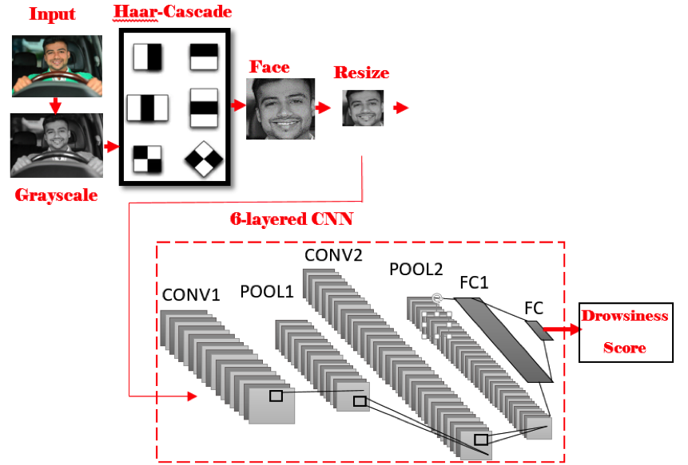

# Drivers-Drowsiness-Detection
Drivers' drowsiness detection using Deep Learning and Computer Vision techniques

## Abstract:

Abstract—Road accidents caused by human error are among the main causes of the death in the world. Specifically, drowsiness and unconsciousness while driving are responsible for many fatal accidents on highways. Accuracy and performance are key metrics related to many researched techniques for the detection of drivers’ drowsiness. To improve these metrics, in this paper, a new method based on image processing and deep learning is proposed. The proposed method is based on facial region diagnosing using the Haar-cascade method and convolutional neural network for drowsiness probability detection. Evaluation analysis of the proposed method on the UTA-RLDD dataset with stratified 5-fold cross-validation showed a high accuracy of 96.8% at a speed of 10 frames per second, which is higher than those that have previously been reported in the literature. For further investigation, a custom dataset including 10 participants in different light conditions was collected. The result of all experiments showed the great potential of the proposed method for practical applications in intelligent transportation systems.

## Introduction: 

There are three important factors in drivers’ drowsiness
detection: feasibility (in terms of cost, comfortably, and availability),
accuracy (true detection rate, reliability), and speed
of the method. Proposing a method that satisfies all three
factors is challenging and of high importance. Since, some
of the previous methods have low accuracy and speed in
detecting drowsiness, the goal of this paper is to propose a new
method for drivers’ drowsiness detection, which is affordable,
real-time, and leads to reliable results. Our proposed method
can overcome these challenges and has high performance. It
is based on drivers’ videos captured by a camera and uses
image processing to detect drowsiness. Therefore, our method
is simple and has low overhead costs, since the system requires
only one camera to be installed inside the car. Moreover, the
reliability and accuracy of the method can be evaluated using
real data. It should be mentioned that the proposed method
uses high-speed image processing techniques, which enables
the method to detect drowsiness in real-time.
