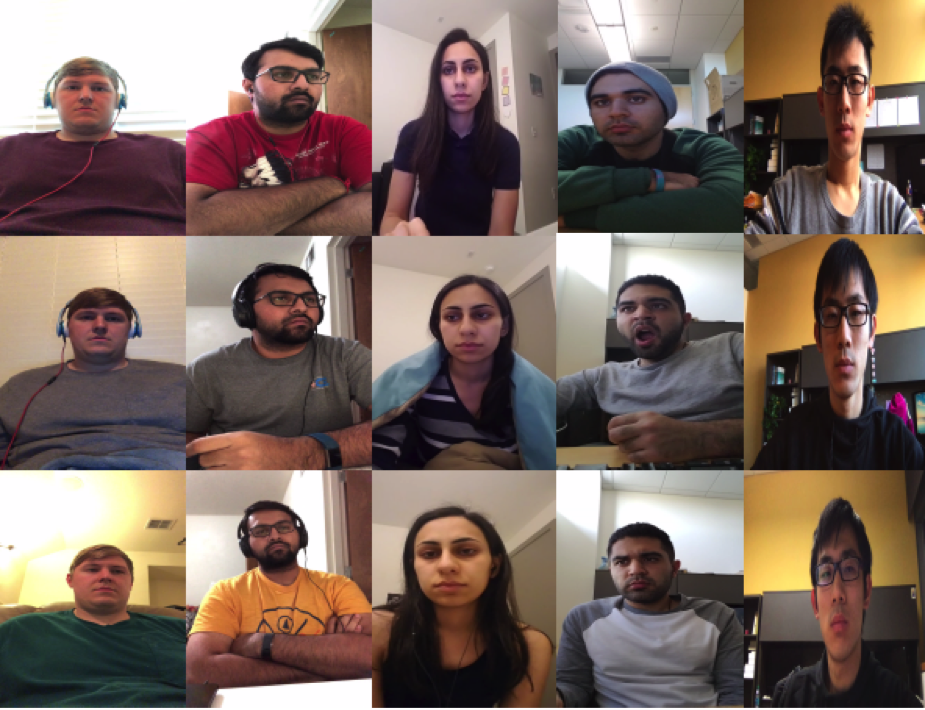
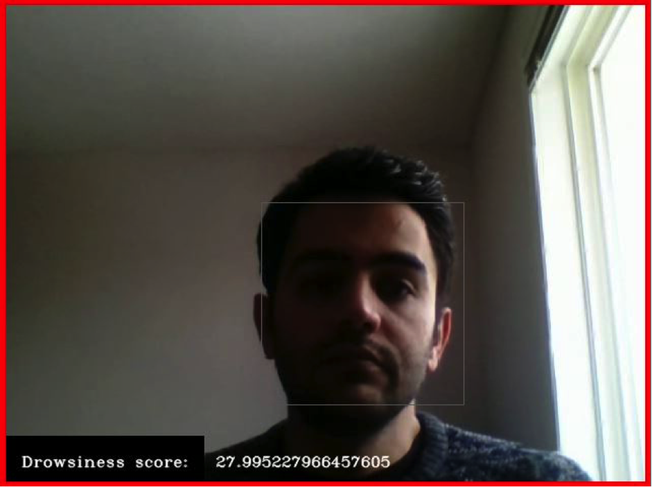
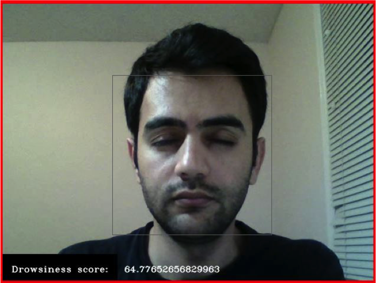

# Drivers-Drowsiness-Detection
Drivers' drowsiness detection using Deep Learning and Computer Vision techniques

## Abstract:

Abstract—Road accidents caused by human error are among the main causes of the death in the world. Specifically, drowsiness and unconsciousness while driving are responsible for many fatal accidents on highways. Accuracy and performance are key metrics related to many researched techniques for the detection of drivers’ drowsiness. To improve these metrics, in this paper, a new method based on image processing and deep learning is proposed. The proposed method is based on facial region diagnosing using the Haar-cascade method and convolutional neural network for drowsiness probability detection. Evaluation analysis of the proposed method on the UTA-RLDD dataset with stratified 5-fold cross-validation showed a high accuracy of 96.8% at a speed of 10 frames per second, which is higher than those that have previously been reported in the literature. For further investigation, a custom dataset including 10 participants in different light conditions was collected. The result of all experiments showed the great potential of the proposed method for practical applications in intelligent transportation systems.

## Introduction: 

There are three important factors in drivers’ drowsiness
detection: feasibility (in terms of cost, comfortably, and availability),
accuracy (true detection rate, reliability), and speed
of the method. Proposing a method that satisfies all three
factors is challenging and of high importance. Since, some
of the previous methods have low accuracy and speed in
detecting drowsiness, the goal of this paper is to propose a new
method for drivers’ drowsiness detection, which is affordable,
real-time, and leads to reliable results. Our proposed method
can overcome these challenges and has high performance. It
is based on drivers’ videos captured by a camera and uses
image processing to detect drowsiness. Therefore, our method
is simple and has low overhead costs, since the system requires
only one camera to be installed inside the car. Moreover, the
reliability and accuracy of the method can be evaluated using
real data. It should be mentioned that the proposed method
uses high-speed image processing techniques, which enables
the method to detect drowsiness in real-time.

## METHODOLOGY

### A) Dataset Descriptions

The model was trained and evaluated on the UTA-RLDD
dataset [32], which is the largest public available dataset.
The UTA-RLDD dataset is stands for the University of Texas
at Arlington Real-Life Drowsiness Dataset[39]. The dataset
has a higher number of samples compared to other available
datasets. These samples can be (or are) grouped into three
classes, namely Alert, Low Vigilance, and Drowsy and consists
of 180 videos taken from 60 participants. Furthermore, these
videos socially and technically diverse:
**1- Nationality: 30 Indo-Aryan and Dravidian, 5 non-white
Hispanic, 8 Middle Eastern, 7 East Asian, and 10 Caucasian,
2- Age: 60 healthy participants in the 20-59 age range from
which 50 are male and 10 are female,
3- Special conditions: Wearing glasses (21 videos), with
beard or mustache (72 videos),
4- Capturing condition: self-recorded videos from different
angles in such a way that both eyes are visible,
5- Video duration: Each video is almost 10 minutes long,
with a frequency of fewer than 30 frames per second.**
Our proposed method solves binary classification for drowsy
and alert samples. As a result, from this dataset we utilized
videos that represent alert and drowsy behaviors.
Furthermore for additional analysis, we collected a custom
dataset with the help of 10 participants, using their laptop’s
webcam, which consists of 53 alert and 69 drowsy videos.
Videos were captured in various light conditions (normal light,
lack of light, very bright). To have a better variety of sleepy
faces, the participants were asked to record the sleepy videos
in three different ways:
**1- Closed eyes and head lean downward,
2- Closed eyes with head straight,
3- Yawning.**

### B) Drowsiness Detection Method

The proposed method for detecting drowsiness consists of
five stages:
1- Converting videos to images,
2 Converting RGB images to grayscale,
3 Cropping face images using Haar-cascade face detection
method,
4- Resizing face images,
5- Feature extraction and image classification using CNN.
First we start by taking the video of a driver, and convert it
into a sequence of images. Then the images are converted into
grayscale images for further processes. In the next step, the
face of the drivers is detected using Haar-cascade method.
Finally, CNN is used as a feature extractor and classifier
to predict the possibility of drivers’ drowsiness.

### RESULTS AND EXPERIMENTS

In order to evaluate and compare the proposed method, we
used stratified k-fold cross validation (STKF), a modification
of k-fold cross validation. The accuracy of the method is
assessed using stratified 5-fold cross validation. The output
images of the preprocessing phase are divided into 5 folds in
such a way that there are almost equal numbers of positive
(drowsy) and negative (vigilant) samples in each fold. In the
first iteration, the model is trained using 4 folds and tested
on the remaining fold, then in the second iteration, one of
the folds, which were previously in the train dataset is chosen
for the test dataset and the other 4-folds for the train dataset.
The procedure repeats until every fold is used once as the test
dataset. Also, it should be noted that 20% of train data were
considered as the validation data in each fold.

In order to set the best hyper-parameters for the proposed
method, various settings are set as follows:
 Batch size : 64, 200, 300
 Epoch number: 15, 50, 100 , 500
 Optimizer: stochastic gradient descent (sgd), Adaptive
Moment Estimation (adam)
The performance of the model on each setting is evaluated
. The results are shown in Figure 3. According to the results,
the last setting with sgd optimizer, batch size 200 and epoch
number 500 shows significantly better accuracy than other
settings.

**CONCLUSION**

In this paper, we proposed a real-time method using image
processing and deep learning techniques, which can detect the
drivers’ drowsiness fast and accurately. The proposed method
consists of five stages. It takes the video of a driver, and
convert it to images. Then the RGB images are converted
to grayscale for further processes. The face of the driver
is detected using Haar-cascade method and cropped from
images. Afterwards, the size of the face image is reduced.
Finally, a CNN is used as a feature extractor and classifier
to predict the probability of drivers’ drowsiness. LeNet is
a simple convolutional neural network that according to our
researches has not been used for drowsiness detection so far.
The architecture of the CNN is inspired by LeNet architecture
and implemented using Keras library in python. The evaluation
of the model using stratified 5-fold cross validation
on UTA-RLDD, shows that the model achieves high values
of evaluation criteria with average accuracy, precision, recall,
and F1-score of 0.918, 0.928, 0.920, and 0.920, respectively.
Moreover, we presented comparison result with a previous
method an we showed that it can outperforms this. In addition,
a custom dataset was used and we showed that our method
achieved 86% accuracy on the train set, 70% on the validation
set and 76% on test set. In conclusion, we believe that our
method has great potential in practical applications and can
contribute if implemented to the reduction of accidents on
roads and increase the safety in intelligence transportation
systems. For future works, higher socio and technical diversity
could increase further the performance on this method.

